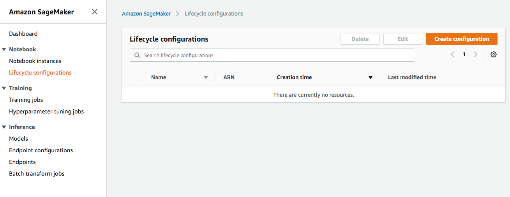
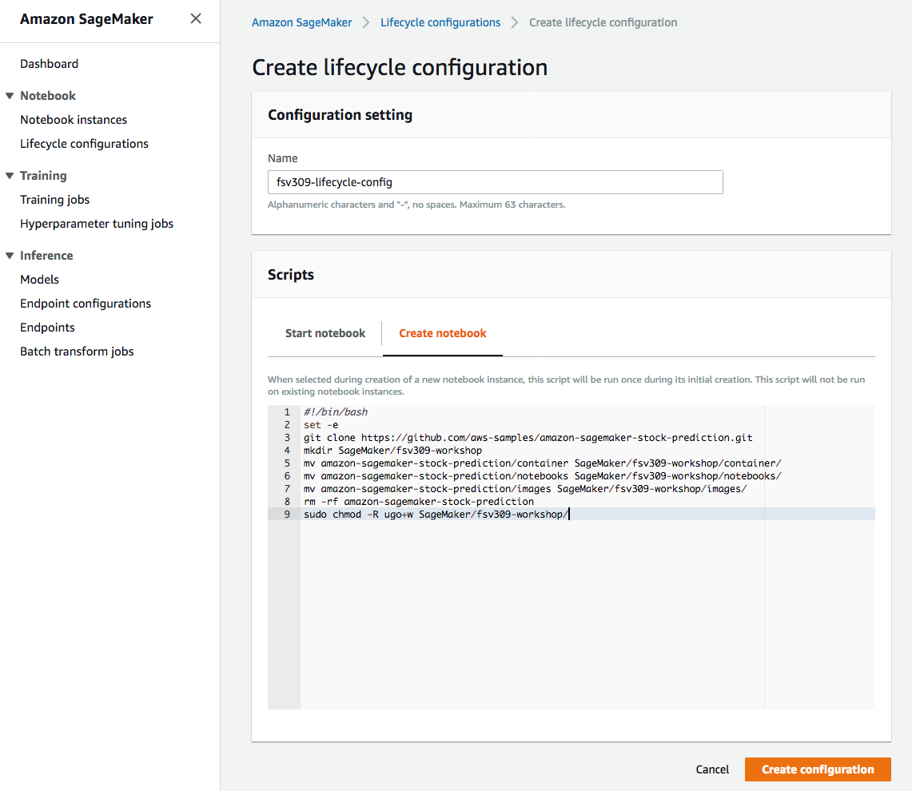
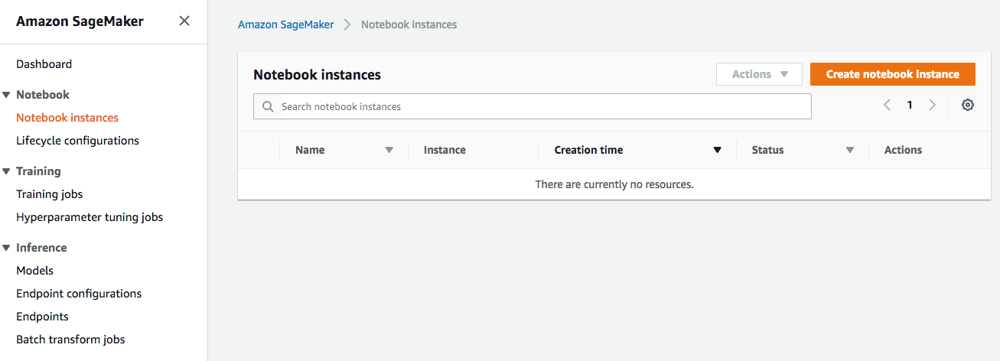
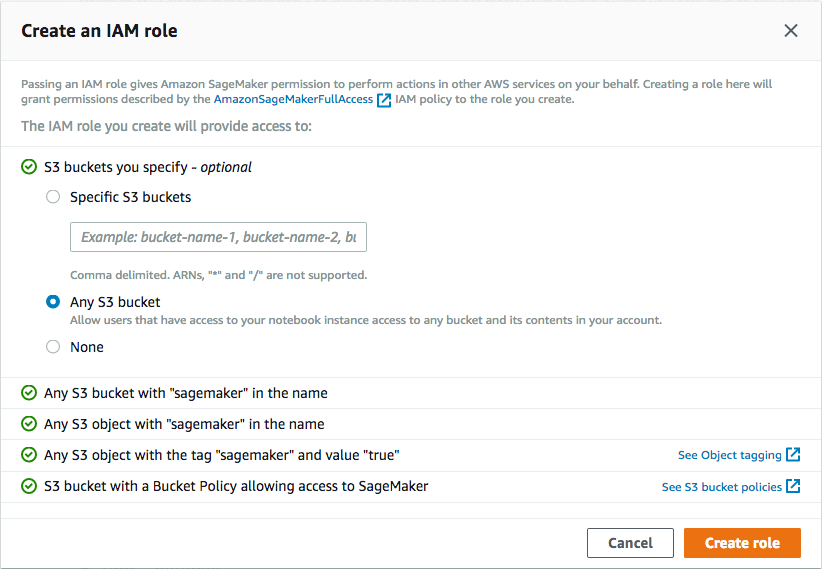
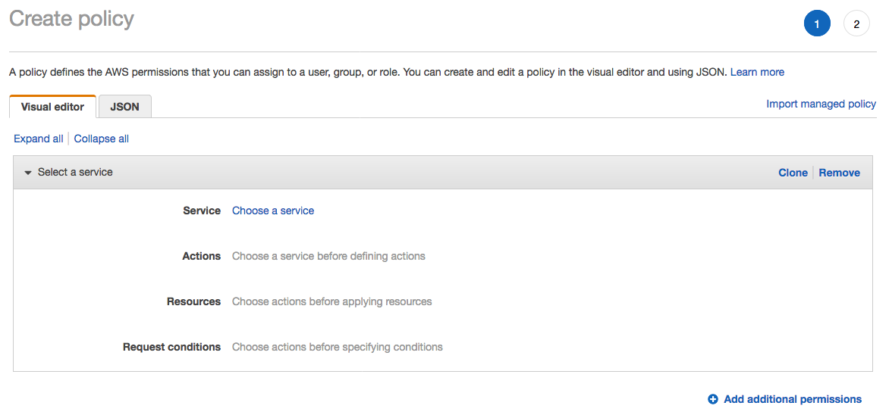
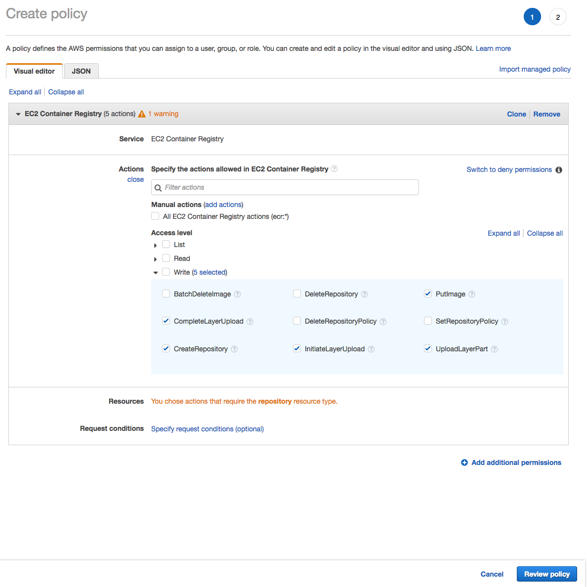
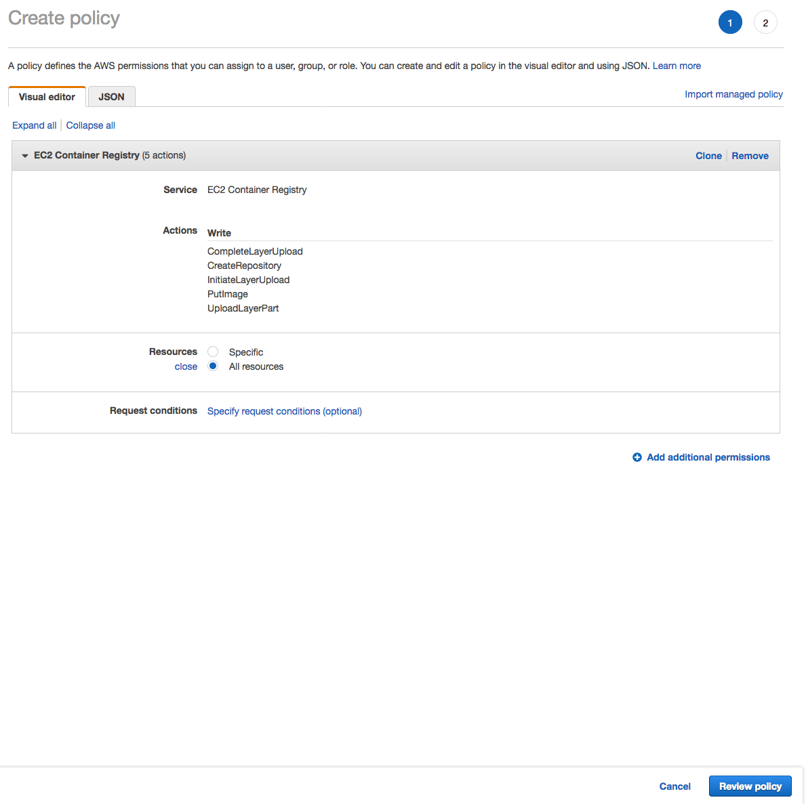
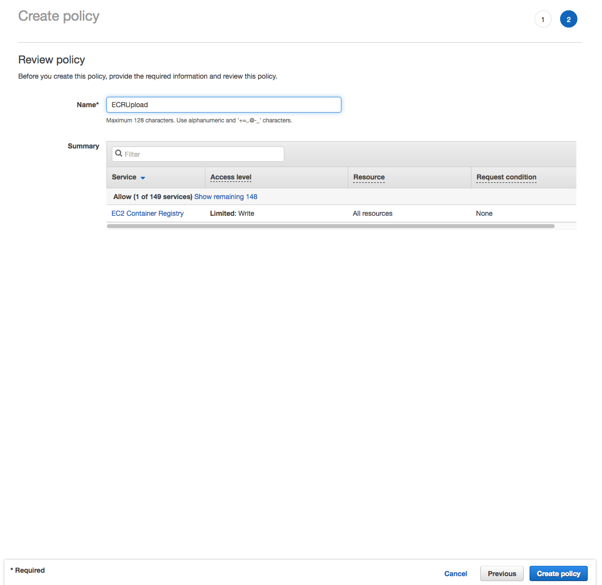
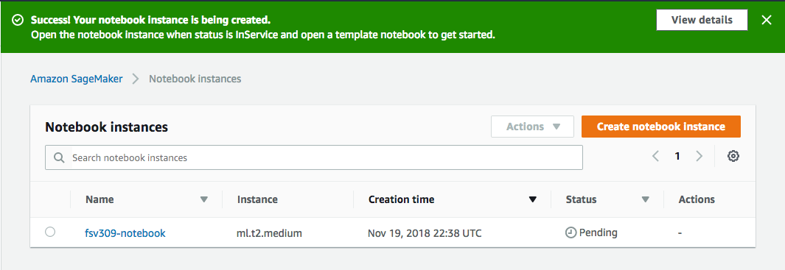
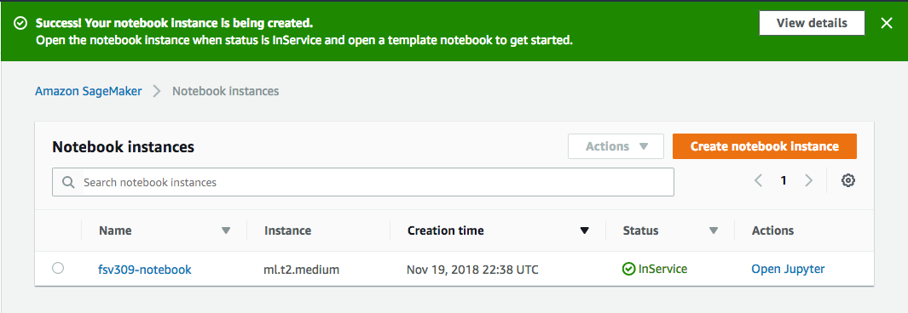

# Stock Prediction using Neural Network on Amazon SageMaker

## License Summary

This sample code is made available under a modified MIT license. See the [LICENSE](./LICENSE) file.

## Introduction

This is a sample workshop that demonstrates how to use a neural network-based algorithm for time series prediction. The workshop uses stock market data maintained by Deutsche Börse and made available through the [Registry of Open Data on AWS](https://registry.opendata.aws/deutsche-boerse-pds/). This dataset contains stock movement data from over 100 stocks traded on the Frankfurt Stock Exchange and is updated by the minute. Data is available starting from July 2016.

Time series data can be analyzed using a variety of techniques, including a simple multilayer perceptron (MLP), a stacked recurrent neural network (RNN), and forecasting methods such as Autoregressive Integrated Moving Average (ARIMA) or Exponential Smoothing (ETS). As a first attempt, we'll use a simple Recurrent Neural Network (RNN) model to predict the price of a single stock.

## Action Plan

[Amazon SageMaker](https://aws.amazon.com/sagemaker/) is the Machine Learning platform on AWS that provides infrastructure to run hosted Jupyter Notebooks. Amazon SageMaker is integrated with other storage and analytics services on AWS to make the essential data management tasks for a successful Machine Learning project secure, scalable and streamlined. 


In this workshop, we'll first use Amazon SageMaker-hosted notebooks to fetch the data from Deutsche Börse dataset, clean it, and aggregate it in [Amazon S3](https://aws.amazon.com/s3/) buckets. 

In addition to hosted notebooks, Amazon SageMaker also provides managed training and hosting for machine learning models, using a variety of languages and libraries. Once we've prepared the data and stored it in Amazon S3, we'll use this functionality to containerize the machine learning training and prediction code, publish it on an [Amazon Elastic Container Registry (Amazon ECR)](https://aws.amazon.com/ecr/) repository, and host our custom model behind an Amazon SageMaker endpoint to generate predictions.

Amazon SageMaker also provides several built-in algorithms for image classification, regression, clustering of structured data, time series processing, and natural language processing. In the latter part of this workshop, we'll use [DeepAR](https://docs.aws.amazon.com/sagemaker/latest/dg/deepar.html), which is a supervised learning algorithm for forecasting one-dimensional time series using RNN.

## Disclaimer

This workshop is not an exercise in statistical methods, nor does it attempt to build a viable stock prediction model that you can use to make money. However, it does showcase the machine learning techniques that you can use on AWS.

## 1. Getting started

Since you will execute most of the workshop steps on a Jupyter Notebook hosted on Amazon SageMaker, start by creating a notebook instance on Amazon SageMaker from the AWS Console.

Refer to the [AWS Region Table](https://docs.aws.amazon.com/general/latest/gr/rande.html#sagemaker_region) to check the availability of Amazon SageMaker, and choose to create the following infrastructure in any of the regions where it is available.

As of re:Invent-2018, Amazon SageMaker is available in the following regions:

- us-east-1 (Northern Virgina)
- us-east-2 (Ohio)
- us-west-1 (California)
- us-west-2 (Oregon)
- ca-central-1 (Canada)
- eu-west-1 (Ireland)
- eu-west-2 (London)
- eu-central-1 (Frankfurt)
- ap-northeast-1 (Tokyo)
- ap-northeast-2 (Seoul)
- ap-southeast-1 (Singapore)
- ap-southeast-2 (Sydney)
- ap-south-1 (Mumbai)
- us-gov-west-1 (AWS GovCloud)

### 1.1. Lifecycle configuration

Lifecycle configurations are small scripts, that you can use to automate certain tasks when a notebook instance is being created and/or being started. For this workshop, create a startup script to download pre-built notebooks from this Github repository onto your notebook instance. 

Configure this script to run on `Create notebook`.

  ```
  #!/bin/bash
  set -e
  git clone https://github.com/aws-samples/amazon-sagemaker-stock-prediction.git
  mkdir SageMaker/fsv309-workshop
  mv amazon-sagemaker-stock-prediction/container SageMaker/fsv309-workshop/container/
  mv amazon-sagemaker-stock-prediction/notebooks SageMaker/fsv309-workshop/notebooks/
  mv amazon-sagemaker-stock-prediction/images SageMaker/fsv309-workshop/images/
  rm -rf amazon-sagemaker-stock-prediction
  sudo chmod -R ugo+w SageMaker/fsv309-workshop/
  ```

<details>
<summary><strong>Step-by-step instructions (expand for details)</strong></summary><p>

  1. In the AWS Management Console choose **Services** then select **Amazon SageMaker** under Machine Learning.

  1. Choose **Lifecycle configurations** under the section **Notebook** on the left panel.
      

  1. Choose **Create configuration** to open the create dialog.

  1. Type the name `fsv309-lifecycle-config` in the `Name` field.

  1. In the tab **Create notebook**, type or copy-paste the `Create Notebook` script from above.
      

  1. Finish configuration by clicking **Create configuration**.

</p></details>


<b>Note:</b> If you don't create a lifecycle configuration or attach the configuration to your notebook instance, you can always run the above commands directly into a Terminal window, from within your instance's Jupyter console.


### 1.2. Notebook instance
1. Use the lifecycle configuration to create a notebook instance in the region of your choice.

1. Choose a small instance class, such as `ml.t2.medium`. Since you won't use this notebook instance to execute training and prediction code, this will be sufficient. 

1. If you do not have an AWS Identity and Access Management (IAM) role created prior with all the necessary permissions needed for Amazon SageMaker to operate, create a new role on the fly.

1. The IAM role you choose to use with the notebook needs to be authorized to create an Amazon ECR repository and upload an container image to the repository. Therefore add the following permissions to the IAM Role that you'll be using for your Notebook instance:
    - ecr:CreateRepository
    - ecr:InitiateLayerUpload
    - ecr:UploadLayerPart
    - ecr:CompleteLayerUpload
    - ecr:PutImage
1. Optionally you can choose to place your instance within a VPC and encrypt all data to be used within notebook to be encrypted. For the purpose of the workshop, you can proceed without doing this.

<details>
<summary><strong>Step-by-step instructions (expand for details)</strong></summary><p>

  1. In the AWS Management Console choose **Services** then select **Amazon SageMaker** under Machine Learning.

  1. Choose **Notebook instances** under the section **Notebook** on the left panel.
      

  1. Choose **Create notebook instance** to open the create dialog.

  1. Type the name `fsv309-notebook` in the `Name` field.

  1. From `Notebook instance type dropdown`, choose `ml.t2.medium`.

  1. From `IAM role` dropdown, choose `Create a new role`.

  1. In the dialog that pops up, select the radio button for `Any S3 bucket`, .
      

  1. Choose **Create Role** to return to the notebook creation dialog. Notice that Amazon SageMaker creates a new execution role with the current timestamp appended at the end of its name, and that this role remains selected under `IAM role` dropdown.

  1. From the `Lifecycle configuration` dropdown, choose the configuration named `fsv309-lifecycle-config`, that you created in section 1.1.

  1. Immediately below the `IAM Role` field, you should see a success message in a green message box, with the name of your newly created IAM role displayed as a hyperlink. Click on the hyperlink to open the role in IAM console in a new browser tab.

  1. From the IAM console page that opens in a new browser tab displaying the role summary, choose **Add Inline policy**
      

  1. On the **Create policy** page, click on **Choose a service**
      

  1. In the suggestive search box, type "EC2", to have the list of displayed service filtered down, then choose **EC2 Container Registry** from the narrowed down list.
      

  1. Under the `Actions` section, expand `Write` Access level

  1. Select actions - **CreateRepository**, **InitiateLayerUpload**, **UploadLayerPart**, **CompleteLayerUpload** and **PutImage**
      

  1. Under the `Resources` section, click on the text displaying `You chose actions that require the policy resource type`.

  1. Choose **All resources** radio button under `Resources` section.
      

  1. Choose **Review policy** at the bottom right-hand corner of the screen.

  1. On the review screen, ensure there are no errors or warnings displayed.

  1. Type a name of the policy in `Name` field, Choose a meaningful name, such as `ECRUpload`.

  1. Choose **Create policy** at the bottom right-hand corner of the screen.
      

  1. Close the browser tab to return to the previous tab for the Amazon SageMaker console.

  1. Leave the VPC selection and Encryption Keys empty for the purpose of this workshop, and choose **Create notebook instance** to finish creation.
      

  1. You'll be returned to the list of notebooks, with the status of current notebook shown as `Pending`. Wait until the status changes to `InService` before proceeding to the next section.
      

  1. When the status of your notebook shows `InService`, click on the `Open Jupyter` link under `Actions` column to open the Jupyter notebook on your instance and proceed to the following sections of this workshop.
      

</p></details>

<!-- ### 1.3. Athena table
Athena allows you to query data directly from S3 buckets, using standard SQL compatible queries. Use the following DDLs to create external table in Athena, and a view containing the fields of interest. Using this view, you can then run queries directly on stock market data as stored in S3 buckets maintained by Deutsche Börse.

Use the DDL provided below to create an Athena table, which currently wouldn't display any data, but you'll be able to run queries and generate QuickSight dashboard against this table once the following data preparation stage is completed.

<details>
<summary><strong>Create tables (expand for details)</strong></summary><p>

1. DDL to create hourly stock data table.

    ```      
    CREATE EXTERNAL TABLE `stockdata_hourly` (
      `CalcDateTime` string, 
      `Mnemonic` string, 
      `MinPrice` float, 
      `MaxPrice` float, 
      `StartPrice` float, 
      `EndPrice` float, 
      `TradedVolume` float, 
      `NumberOfTrades` float)
    ROW FORMAT SERDE 
      'org.apache.hadoop.hive.serde2.OpenCSVSerde' 
    WITH SERDEPROPERTIES ( 
      'separatorChar'=',',
      'quoteChar'='"',
      'skip.header.line.count'='1') 
    STORED AS INPUTFORMAT 
      'org.apache.hadoop.mapred.TextInputFormat' 
    OUTPUTFORMAT 
      'org.apache.hadoop.hive.ql.io.HiveIgnoreKeyTextOutputFormat'
    LOCATION
      's3://<Your S3 Bucket Name>/dbg-stockdata/source/H/'
    TBLPROPERTIES (
      'classification'='csv')
    ```

1. DDL to create daily stock data table.

    ```      
    CREATE EXTERNAL TABLE `stockdata_daily` (
      `CalcDateTime` string, 
      `Mnemonic` string, 
      `MinPrice` float, 
      `MaxPrice` float, 
      `StartPrice` float, 
      `EndPrice` float, 
      `TradedVolume` float, 
      `NumberOfTrades` float)
    ROW FORMAT SERDE 
      'org.apache.hadoop.hive.serde2.OpenCSVSerde' 
    WITH SERDEPROPERTIES ( 
      'separatorChar'=',',
      'quoteChar'='"',
      'skip.header.line.count'='1') 
    STORED AS INPUTFORMAT 
      'org.apache.hadoop.mapred.TextInputFormat' 
    OUTPUTFORMAT 
      'org.apache.hadoop.hive.ql.io.HiveIgnoreKeyTextOutputFormat'
    LOCATION
      's3://<Your S3 Bucket Name>/dbg-stockdata/source/D/'
    TBLPROPERTIES (
      'classification'='csv')
    ```

</p></details>


<details>
<summary><strong>Create views (expand for details)</strong></summary><p>

1. Since the table infers all date columns as strings and number columns as decimals, use the following DDL to create an hourly view, casting the columns to appropriate data types.    

    ```      
    CREATE OR REPLACE VIEW "stockdata_hourly_view" AS
    SELECT date_parse(stock.calcdatetime, '%Y-%m-%d %H:%i:%s') AS CalcDateTime,
            stock.Mnemonic as Mnemonic,
            stock.MinPrice as MinPrice,
            stock.MaxPrice as MaxPrice,
            stock.StartPrice as StartPrice,
            stock.EndPrice as EndPrice,
            cast(stock.TradedVolume as integer) as TradedVolume,
            cast(stock.NumberOfTrades as integer) as NumberOfTrades
    FROM stockdata_hourly AS stock
    ```

1. Since the table infers all date columns as strings and number columns as decimals, use the following DDL to create a daily view, casting the columns to appropriate data types.    

    ```      
    CREATE OR REPLACE VIEW "stockdata_daily_view" AS
    SELECT date_parse(stock.calcdatetime, '%Y-%m-%d') AS CalcDateTime,
            stock.Mnemonic as Mnemonic,
            stock.MinPrice as MinPrice,
            stock.MaxPrice as MaxPrice,
            stock.StartPrice as StartPrice,
            stock.EndPrice as EndPrice,
            cast(stock.TradedVolume as integer) as TradedVolume,
            cast(stock.NumberOfTrades as integer) as NumberOfTrades
    FROM stockdata_daily AS stock
    ```

</p></details> -->

## 2. Data preparation

The Deutsche Börse Public Data Set consists of trade data aggregated at one-minute intervals. While such high-fidelity data could provide excellent insight and prove to be a valuable tool in quantitative financial analysis, for the scope of this workshop, it would be more convenient to work with data aggregated at a larger interval rate, such as daily and hourly intervals.

Moreover, the source dataset is organized into hierarchical S3 bucket prefixes, according to date and time and the data contains some missing days, hours, either due to non-trading windows, or due to errors in data collection. In the [dbg-data-preparation](notebooks/dbg-data-preparation.ipynb) notebook, you'll download raw data from source for an interval of your choosing, resample the data at hourly and daily intervals, and upload to your own S3 bucket. 

Within this notebook, you'll also find code to that you can use to grab the cleaned data directly from an S3 bucket maintained for this workshop. This alternative will save you time because you do not have to execute code to obtain data from the source and cleanse it yourself. In order to use the second option, execute the cells in the notebook from section **2.5** onward.

Whichever way you choose, proceed to obtain the data by executing code in [dbg-data-preparation](notebooks/dbg-data-preparation.ipynb) from your Amazon SageMaker notebook instance, and come to the next section of this readme when finished.

## 3. Data analysis

After we prepared the data, we did some preliminary analysis and observed that :
- Minimum and maximum prices during an interval are possible indicators of closing Price, in that during an upward trend of prices, closing price is closer to maximum price, whereas during a downward trend it is closer to minimum price.
- Minimum and maximum price during an interval are possible indicators of opening Price, in that during an upward trend of prices, opening price is closer to minimum price, whereas during a downward trend it is closer to maximum price.
- Opening price during an interval is possible indicator of closing Price, in that during an upward trend of prices, closing price is above opening price, whereas during a downward trend it is below opening price.

The insights above are useful because while predicting closing price of stocks, these insights indicate that we could use these other metrics as determining features that has influence on the target metric. We'll use this insight when we build the deep neural network models in next two sections.

As one would imagine, individual stocks' movement doesn't exist in vacuum. Often times, companies in related industries, or in similar businesses, follow similar patterns. If we could find similar companies' stocks, it would allow us to use these other stocks as exogenous time series, while predicting a particular stock as main time series.

Empirically, we can assume that companies in similar industries, such as the automobile or telecommunication industries would have some bearing on each others' price movements. In order to confirm this intuition, you can execute the code in [dbg-stock-clustering](notebooks/dbg-stock-clustering.ipynb) notebook, to have the similar stocks clustered, using the [**HDBSCAN**](https://hdbscan.readthedocs.io) algorithm.

Although the clustering result may vary depending on the time period you choose while running the algorithm and the similarity function you choose, for the stocks in this dataset, they should be clustered somewhat similarly as shown in the diagram below.

<details>
<summary><strong>Clustered stock view (expand for diagram)</strong></summary><p>

Some prominent clusters are highlighted manually in this image, based on the clustering algorithm output.

  

</p></details>
<br>

To see for yourself, you can execute the code in [dbg-stock-clustering](notebooks/dbg-stock-clustering.ipynb) from your Amazon SageMaker notebook instance and come to the next section of this readme when finished.


## 4. Custom Recurrent Neural Network (RNN)

Forecasting the evolution of events over time is essential in many applications, such as financial analysis, climatology, logistics, and supply chain management. Although predicting the future is hard, and requires availability of reliable and effective indicators, the infrastructure tools and algorithmic techniques are readily available on AWS. 

Following two modules in this workshop will provide you with an understanding of how **Recurrent Neural Network (RNN)**-based deep learning algorithms can be applied to sequential data, such as the stock market data. You'll also know where to start if you decide to use an AWS provided algorithm for this purpose.

At a high level, you'll follow the plan as described in the session plan diagram:

  

As a first step, you'll use a custom RNN-based algorithm, following the [dbg-custom-rnn](notebooks/dbg-custom-rnn.ipynb) notebook. Since the data preparation steps have already been completed in previous modules, you'll simply submit your model to Amazon SageMaker for training. Once trained, you'll deploy the model to generate predictions, forecast future stock values, and visualize within the notebook to see the performance of the model you deployed.

Although it is possible to execute training using the compute available in your own Notebook instance, containerizing your code and submitting to Amazon SageMaker for training has a number of advantages. Managed training and hosting services on Amazon SageMaker not only gives you flexibility of choosing the appropriately sized compute resources, it also ensures you only pay for what you actually use. Moreover, this approach makes it easier for data engineers to establish model pipelines by allowing them to automated these tasks in a repeatable fashion.

You can refer to the [Amazon SageMaker build framework](https://github.com/aws-samples/aws-sagemaker-build) as a reference implementation of CI/CD framework for automated build and deployment of machine learning models.

For now, you can proceed to train and deploy the custom RNN model following the code in the [dbg-custom-rnn](notebooks/dbg-custom-rnn.ipynb) notebook. Once finished, you can come back to the following section of this readme to explore another approach, using one of Amazon SageMaker's native algorithms, as provided by AWS, free of charge.


## 5. SageMaker DeepAR

The previous module served to demonstrate that even without covariate data from meaningful external source, using RNN-based model, it is possible to predict stock price movements better than random guessing. There are, however, better algorithms that might be able to improve upon the forecasting results obtained by our crude RNN-based model, as you'll see in the [dbg-deepar](notebooks/dbg-deepar.ipynb) notebook.

Classical forecasting methods, such as **ARIMA (Autoregressive Integrated moving average)**, attempts to predict a future value by regressing a target time series itself on some lag. This technique is further improved by **ARIMAx**, which includes covariates and does the regression on the lag of the series itself and the other related time series. In both cases, another part of regression is done on some lag of random fluctuations around the moving average, thereby accounting for the stochastic part (as in moving average - MA).

One major drawback in both of these classical approaches is that they fit a single model to each individual time series. In reality however, such as in the case of the stock market data we are exploring in this workshop, we encounter many similar time series across a set of cross-sectional units. It is beneficial in such cases to train a single model jointly over all these time series.

[Amazon SageMaker DeepAR](https://docs.aws.amazon.com/sagemaker/latest/dg/deepar.html) follows this approach and can train a model with hundreds of time series. Once trained, such a model can then be used to forecast any of the time series' values into the future. As compared to our custom RNN approach, you would not need to train different models to predict movements of different stocks.

A recent feature addition in DeepAR is inclusion of dynamic features, which works in a way similar to how we used covariates in our custom RNN based model. Using dynamic features, as supporting time series that help explain the variability of the main time series, you can easily improve upon the prediction accuracy. Values of dynamic feature series' however have to be known for the forecast horizon. Although you will be using metrics from the same data set as dynamic features in this workshop, it is not realistic to know the values of those in advance throughout the forecast horizon. 

In order to adopt the techniques you learn in this workshop to a real world use case, you might use data such as forward looking bond prices, federal interest rate, companies' revenue or sales guidance, option pricing etc. DeepAR's support of dynamic feature would then allow you to incorporate such additional knowledge about future into your model, thereby allowing you to forecast the future prices better.

You can now proceed to explore the final approach of predicting stock price movements using DeepAR, following the code in the [dbg-deepar](notebooks/dbg-deepar.ipynb) notebook.

## 5. Cleanup

One advantage of using AWS for your Machine Learning pipeline is that you do not have to procure expensive infrastructure, and that you can spin up the resources just in time, and spin them down when not in use.

In sections 3 and 4 of this workshop, you trained your model using hosted training job, during which Amazon SageMaker used instance of your type chosen only during the time training job was running. After job finishes, the entry you see on Amazon SageMaker console, under `Training Jobs` is merely a record of the jobs that run, and doesn't consume any resources. 

However, the endpoints that you created by deploying your models in both cases resulted in long running resources that you could use to serve your customers in a production scenario. In this case, however, you have cleaned up the endpoints to avoid any cost overrun by executing the last cell in respecting notebooks. In case you haven't done so, you can always delete the endpoints from the Amazon SageMaker console, by selecting the endpoints displayed under `Endpoints` section, and choosing `Delete` Action.

Lastly, the notebook instance itself can and should be either stopped or terminated. If you choose to retain your work, you can simply visit the `Notebook instances` section in your Amazon SageMaker console and stop the instance. You can always turn it back on later, and it will retain all of your work.
