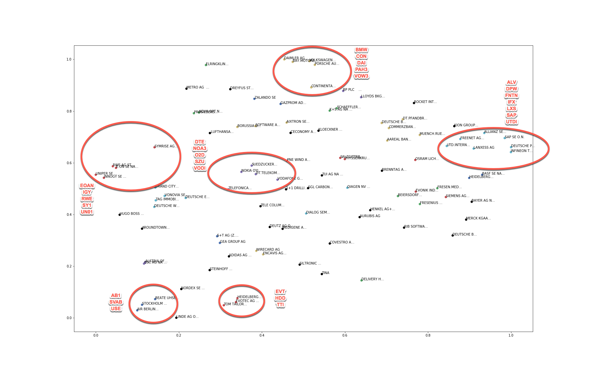
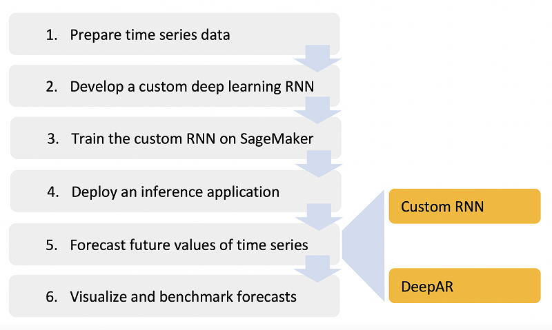

# Stock Prediction using Neural Networks on Amazon SageMaker

## Introduction

This is a sample workshop that demonstrates how to use neural networks based algorithm for time series prediction. The workshop uses stock market data maintained by Deutsche Börse under [Registry of open data](https://registry.opendata.aws/deutsche-boerse-pds/) on AWS. This dataset continaes minute by minute stock movement data from EU market, containing 100+ securities, tracked since July, 2016.

Time series data can be analysed using a variety of techniques, ranging from a simple Multi Layer Perceptron, to a stacked Recurrent Neural Network, using forecasting methods such as Autoregressive Integrated Moving Average (ARIMA) or Exponential Smoothing (ETS). As a first attempt, we'll use a simple RNN based model to predict stock price a single security.

## License Summary

This sample code is made available under a modified MIT license. See the LICENSE file.

## Action Plan

[Amazon SageMaker](https://aws.amazon.com/sagemaker/), is the Machine Learning platform on AWS that provides infrastructure to run hosted Jupyetr Notebooks. Being integrated with other storage and analytics services on AWS, data collection, preparation and visualization, all essential tasks for a successful Machine Learning project becomes more secured and streamlined on SageMaker. 


In this workshop, we'll use SageMaker hosted notebooks to fetch the data from Deutsche Börse dataset, clean up and aggregate the data on [Amazon S3](https://aws.amazon.com/s3/) buckets. We'll also use [Amazon Athena](https://aws.amazon.com/athena/) to query the data and [Amazon QuickSight](https://aws.amazon.com/quicksight/) to visuaize the data. This will allows us to develop an intuition about the nature of the data.

In addition to hosted Notebooks, SageMaker also provdes managed training and hosting for Machine Learning models, using a variety of languages and libraries. In our first attempt, after we build a model locally, we'll use this functionality to containerize the training and prediction code, publish on an [Amaozn ECR](https://aws.amazon.com/ecr/) repository, and host our custom model behind a SageMaker endpoint to generate prediction.

SageMaker also provides several built in algorithms, for image classification, regression and clustering of structured data, timeseries processing and natural language processing. In the later part of this workshop we'll use [DeepAR](https://docs.aws.amazon.com/sagemaker/latest/dg/deepar.html), which is a supervised learning algorithm for forecasting one-dimensional time series using RNN.

## Disclaimer

This workshop is not an exercise in statistical methods, neither does it attempt to build a viable stock prediction model that you can use to make money. However it does showcase the techniques that you can use on AWS Machine Learning platform

## 1. Getting Started

Since you will execute most of the workshop steps on a Jupyter Notebook hosted on SageMaker, start by creating a notebook instance on SageMaker from AWS Console.

Refer to [AWS Region Table](https://aws.amazon.com/about-aws/global-infrastructure/regional-product-services/) to check the availability of SageMaker service, and choose to create the following infrastructure in any of the regions where it is available.
As of re:Invent-2018, SageMaker is available in the following regions:
- us-east-1 (Northern Virgina)
- us-east-2 (Ohio)
- us-west-2 (Oregon)
- eu-west-1 (Ireland)
- eu-central-1 (Frankfurt)
- ap-northeast-1 (Tokyo)
- ap-northeast-2 (Seoul)
- ap-southeast-2 (Sydney)


### 1.1. Lifecycle configuration
1.  Lifecycle configurations are small bootup scripts, that you can use to automate certain tasks when a Notebook instance in being created and/or being started. For this workshop, create a startup script to download pre-built notebooks from this Github repository onto your notebook instance. 

<details>
<summary><strong>Create configuration (expand for details)</strong></summary><p>
Configure this script to run on `Create notebook`.

    ```
    #!/bin/bash
    set -e
    git clone https://github.com/aws-samples/amazon-sagemaker-stock-prediction.git
    mkdir SageMaker/fsv309-workshop
    mv amazon-sagemaker-stock-prediction/container SageMaker/fsv309-workshop/container/
    mv amazon-sagemaker-stock-prediction/notebooks SageMaker/fsv309-workshop/notebooks/
    mv amazon-sagemaker-stock-prediction/images SageMaker/fsv309-workshop/images/
    mv amazon-sagemaker-stock-prediction/pretrained-model SageMaker/fsv309-workshop/pretrained-model/
    rm -rf amazon-sagemaker-stock-prediction
    sudo chmod -R ugo+w SageMaker/fsv309-workshop/
    sudo yum install -y docker
    ```

Also create a  startup script as follows, and configure it to run on `Start Notebook`.

    ```
    #!/bin/bash
    set -e
    sudo service docker start
    ```

</p></details>

### 1.2. Notebook instance
1. Use the lifecycle configuration to create Notebook instance in a region of your choice.
1. Choose a moderatly sized memory optimized instance class, such as `ml.m4.xlarge`
1. If you do not have an IAM role created prior with all the necessary permissions needed for SageMaker to operate, create a new role on the fly.
1. Optionally you can choose to place your instance within a VPC and encrypt all data to be used within notebook to be encrypted. For the purpose fo the workshop you can proceed without these mechanisms to protect the notebook.

### 1.3. Athena Table
Athena allows you to query data directly from S3 buckets, using standard SQL compatible queries. Use the following DDLs to create external table in Athena, and a view containing the fields of interest. This allow you to run queries directly on stock market data as stored in S3 buckets maintained by Deutsche Börse.

Use the DDL provided below to create an Athena table, which currently wouldn't display any data, but you'll be able to run queries and generate QuickSight dashboard against this table once the following data preparation stage is completed.

<details>
<summary><strong>Create tables (expand for details)</strong></summary><p>

1. DDL to create hourly stock data table.

    ```      
    CREATE EXTERNAL TABLE `stockdata_hourly` (
      `CalcDateTime` string, 
      `Mnemonic` string, 
      `MinPrice` float, 
      `MaxPrice` float, 
      `StartPrice` float, 
      `EndPrice` float, 
      `TradedVolume` float, 
      `NumberOfTrades` float)
    ROW FORMAT SERDE 
      'org.apache.hadoop.hive.serde2.OpenCSVSerde' 
    WITH SERDEPROPERTIES ( 
      'separatorChar'=',',
      'quoteChar'='"',
      'skip.header.line.count'='1') 
    STORED AS INPUTFORMAT 
      'org.apache.hadoop.mapred.TextInputFormat' 
    OUTPUTFORMAT 
      'org.apache.hadoop.hive.ql.io.HiveIgnoreKeyTextOutputFormat'
    LOCATION
      's3://<Your S3 Bucket Name>/dbg-stockdata/source/H/'
    TBLPROPERTIES (
      'classification'='csv')
    ```

1. DDL to create daily stock data table.

    ```      
    CREATE EXTERNAL TABLE `stockdata_daily` (
      `CalcDateTime` string, 
      `Mnemonic` string, 
      `MinPrice` float, 
      `MaxPrice` float, 
      `StartPrice` float, 
      `EndPrice` float, 
      `TradedVolume` float, 
      `NumberOfTrades` float)
    ROW FORMAT SERDE 
      'org.apache.hadoop.hive.serde2.OpenCSVSerde' 
    WITH SERDEPROPERTIES ( 
      'separatorChar'=',',
      'quoteChar'='"',
      'skip.header.line.count'='1') 
    STORED AS INPUTFORMAT 
      'org.apache.hadoop.mapred.TextInputFormat' 
    OUTPUTFORMAT 
      'org.apache.hadoop.hive.ql.io.HiveIgnoreKeyTextOutputFormat'
    LOCATION
      's3://<Your S3 Bucket Name>/dbg-stockdata/source/D/'
    TBLPROPERTIES (
      'classification'='csv')
    ```

</p></details>

<details>
<summary><strong>Create views (expand for details)</strong></summary><p>

1. Since the table infers all date columns as strings and number columns as decimals, use the following DDL to create an hourly view, casting the columns to appropriate data types.    

    ```      
    CREATE OR REPLACE VIEW "stockdata_hourly_view" AS
    SELECT date_parse(stock.calcdatetime, '%Y-%m-%d %H:%i:%s') AS CalcDateTime,
            stock.Mnemonic as Mnemonic,
            stock.MinPrice as MinPrice,
            stock.MaxPrice as MaxPrice,
            stock.StartPrice as StartPrice,
            stock.EndPrice as EndPrice,
            cast(stock.TradedVolume as integer) as TradedVolume,
            cast(stock.NumberOfTrades as integer) as NumberOfTrades
    FROM stockdata_hourly AS stock
    ```

1. Since the table infers all date columns as strings and number columns as decimals, use the following DDL to create a daily view, casting the columns to appropriate data types.    

    ```      
    CREATE OR REPLACE VIEW "stockdata_daily_view" AS
    SELECT date_parse(stock.calcdatetime, '%Y-%m-%d') AS CalcDateTime,
            stock.Mnemonic as Mnemonic,
            stock.MinPrice as MinPrice,
            stock.MaxPrice as MaxPrice,
            stock.StartPrice as StartPrice,
            stock.EndPrice as EndPrice,
            cast(stock.TradedVolume as integer) as TradedVolume,
            cast(stock.NumberOfTrades as integer) as NumberOfTrades
    FROM stockdata_daily AS stock
    ```

</p></details>

## 2. Data preparation

Deutsche Börse Public Data Set consists of trade data aggregated one minute intervals. While such high fidelity data could provide an excellent insight and prove to be a valuable tool in quantitative finanical analysis, for the scope of this workshop data aggregated at a larger interval rate, such as daily and hourly would be more convenient to deal with.

Moreover, the source dataset is organized into hierarchical S3 bucket prefixes, according to date and time and contains some missing days, hours, either due to non-trading window, or due to error in data collection. In the [dbg-data-preperation](notebooks/dbg-data-preperation.ipynb) notebook, you'll download raw data from source for an interval of your chosing, and have the resampled data aggregated at hourly and daily level uploaded to your own S3 bucket, which will bucket analysis eaiser. 

Within this notebook, you'll also find code to that you could use to grab the cleaned data directly from an S3 bucket maintained for this workshop. This alternative will save you time in that you do not have to execute code to grab data from source and cleanse yourself. In order to use this option of obtaining data, execute the cells in the notebook from section **2.5** onward.

Whichever way you choose, proceed to obtain the data by executing code in [dbg-data-preperation](notebooks/dbg-data-preperation.ipynb) from your SageMaker Notebook instance, and come to the next section of this readme when finished.

## 3. Data Analysis

After we prepared the data, we did some preliminary analysis and observed that :
- Minimum and maximum prices during an interval are possible indicators of closing Price, in that during an upward trend of prices, closing price is closer to maximum price, whereas during a downward trend it is closer to minimum price.
- Minimum and maximum price during an interval are possible indicators of opening Price, in that during an upward trend of prices, opening price is closer to minimum price, whereas during a downward trend it is closer to maximum price.
- Opening price during an interval is possible indicator of closing Price, in that during an upward trend of prices, closing price is above opening price, whereas during a downward trend it is below opening price.

The insights above are useful becasue while predicting closing price of stocks, these indicates that we could use these other metrices as determining features that has influence on the target metric. We'll use this insight when we build the deep neural network models in next two sections.

As one would imagine individual stocks' movement doesn't exist in vaccuum. Often times, companies in related industries, or in similar businesses, follow similar pattern. IF we could find similar companies' stocks, it would allow us to use these other stocks as exogenous time series, while predicting a particular stock as main time series.

Empirically we can assume that companies in similar industries, such as automobile or telecommunication industry would have some bearing on each others' price movements. In order to confirm this intuition, you can execute the code in [dbg-stock-clustering](notebooks/dbg-stock-clustering.ipynb) notebook, to have the similar stocks clustered, using the **HDBSCAN** algorithm.

Although clustering result may vary depending on the time period you choose while running the algorithm, and the similarity function you choose, for the stocks in this dataset, they should be clustered somewhat similarly as shown in the diagram below.

<details>
<summary><strong>Clustered stock view (expand for diagram)</strong></summary><p>

Some prominent clusters are highlighted manually in this image, based on the clustering algortihm output.

  

</p></details>
<br>

To see for yourself, you can execute the code in [dbg-stock-clustering](notebooks/dbg-stock-clustering.ipynb) from your SageMaker Notebook instance and come to the next section of this readme when finished.


## 4. Custom RNN

Forecasting the evolution of events over time is essential in many applications, ranging from financial analysis, to climatoloy, to logistics and supply chain management. Although predicting future is hard, and requires availability of good reliable indicators, the underlying infrastructure tools and algorithmic techniques are available on AWS, and is the main focus of this workshop. 

Following the next two modules in this workshop, you'll have an understanding of how **Recurrent Neural Network (RNN)** based deep learning algorithms can be applied to such sequence data, as the stock market data that we are using in this workshop. You'll also know where to start if you decide to use AWS provided algorithm for this purpose.

At a high level, you'll follow the plan as described in the session plan diagram:

  

As a first step, you'll use a custom RNN based algorithm, following the [dbg-custom-rnn](notebooks/dbg-custom-rnn.ipynb) notebook. Since the data preparation steps have already been completed in previous modules, using this notebook, you'll simply submit your model to SageMaker for training. Once trained, you'll deploy the model to generate prediciton and lastly you'll forecast future value of stock price time series and visualize within the notebook to see the performance of the model you deployed.

When using your own algorithm, you can always start running the data formatting, loading, and model training and prediction generation code within your notebook environment. However in order to productionize your model, you would use managed training and hosting. This approach not only gives you flexibility of choosing the appropriately sized compute and ensures you only pay for what you actually use, it also makes it easier for data engineers to establish model pipelines, whereby such tasks can be automated in a repeatbale fashion, by leveraging  native integration with various other event and analytics services. 

You can refer to SageMaker build framework, as described in [aws-sagemaker-build](https://github.com/aws-samples/aws-sagemaker-build) repository, to automate build and deployment of machine learning models.

For now, you can proceed to train and deploy the custom RNN model following the code in the [dbg-custom-rnn](notebooks/dbg-custom-rnn.ipynb) notebook. Once finished, you can come back to the following section of this readme to explore another approach, using one of SageMaker native algorithms, as provided by AWS, free of charge.


## 5. SageMaker DeepAR

The previous module served to deonstrate that even without use of meaningful covariate data, using RNN based deep neural network, it is possible to predict stock price movements better than random guess. There are however better algorithms that might be able to improve upon the forecasting results obtained by our crude RNN based model, as you'll see in the [dbg-deepar](notebooks/dbg-deepar.ipynb) notebook.

Classical forecasting methods, such as **ARIMA (Autoregressive Integrated mooving average)**, attempts to predict a future value by regressing a target time series itself on some lag. This technique is further improved by **ARIMAx**, which includes covariates and does the regression on the lag of the series of itself and the other related time series. In both cases, another part of regression is done on some lag of random fluctuations around the moving average, thereby accounting for the stochastic part (as in moving average - MA).

One major drawback in both of these classical approaches is that it fits a single model to each individual time series. In reality however, such as in the case of the stock market data we are exploring in this workshop, we encounter many similar time series across a set of cross-sectional units. It is beneficial, in such cases, to train a single model jointly over all these time series.

[Amazon SageMaker DeepAR](https://docs.aws.amazon.com/sagemaker/latest/dg/deepar.html) follows this approach and can train a model with hundreds of time series. Once trained, such a model can then be used to forecast any of the time series' values into the future. As compared to our custom RNN approach, you would not need to train different model to predict movements of different stocks.

A recent feature addition in DeepAR is inclusion of dynamic features, which works similarly as we used covariates in our custom RNN based model. Using dynamic features, as supporting time series' that help explain the variability of the main time serieses, you can easily improve upon the prediction accuracy. Values of dynamic feature series' however have to be known for the forecast horizon. Since we are using other metrices related to stock price as dynamic features in this workshop example, it is not realistic to know the values of those in advance, throughout the forecast horizon. 

In reality however, you might discover data, such as forward looking bond prices, federal interest rate, companies revenue or sales guidance, option pricing etc. DeepAR's support of dynamic feature would then allow you to incorporate such additional knowledge about future into your model, thereby allowing you to forecast the futre prices better.

You can now proceed to explore the final approach, of predicting stock price movements using DeepAr, following the code in the [dbg-deepar](notebooks/dbg-deepar.ipynb) notebook.

